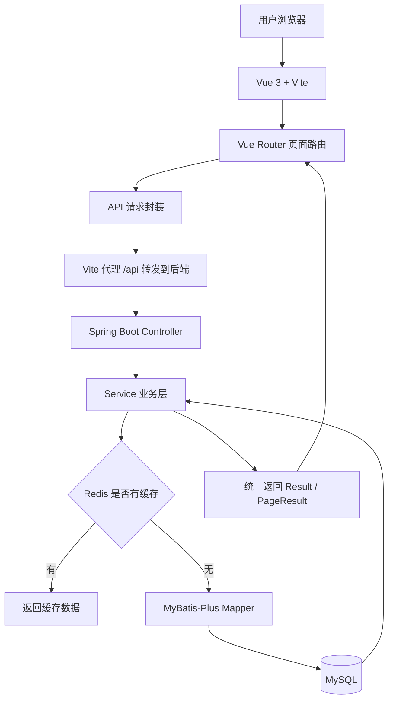
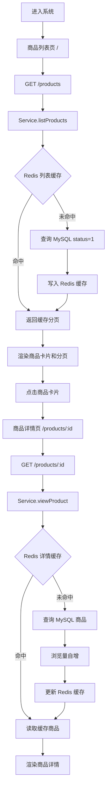
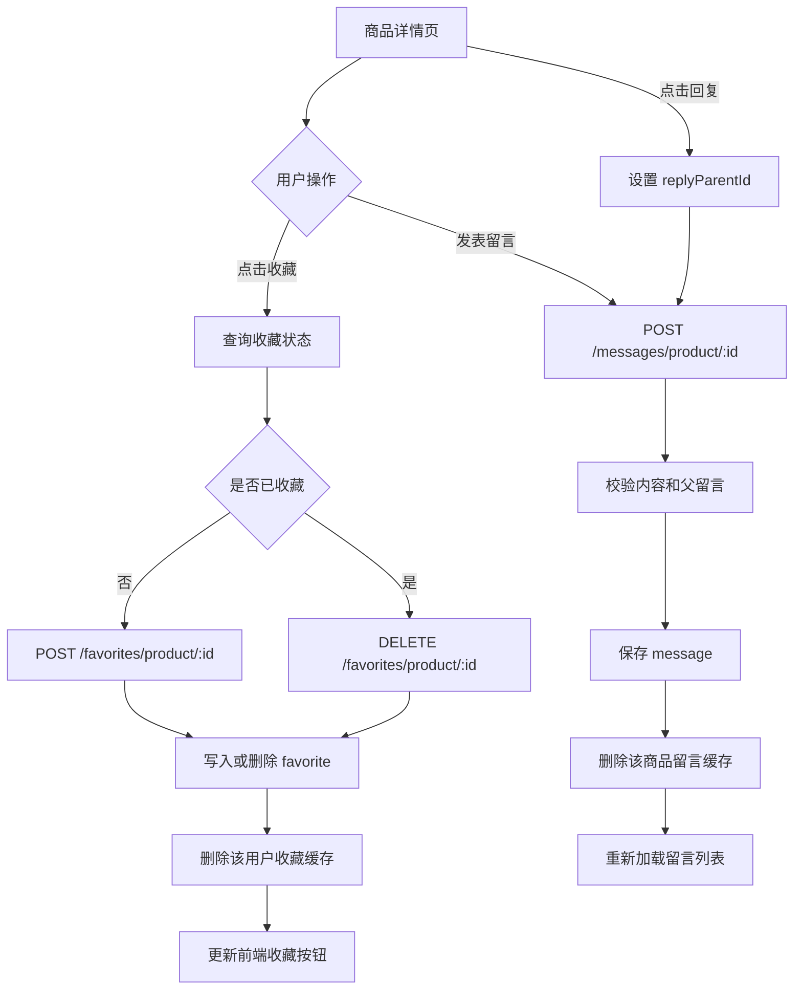

# 校园二手交易系统功能梳理与流程图

## 1. 系统概览

本项目是一个校园二手交易系统，前端使用 Vue 3 + Vite，后端使用 Spring Boot，数据访问使用 MyBatis-Plus，业务数据存储使用 MySQL，热点数据使用 Redis 缓存。

主要用户场景如下：

1. 进入商品列表页，浏览在售商品。
2. 按分类筛选，或按标题、描述关键词搜索。
3. 点击商品卡片进入详情页，查看完整信息。
4. 收藏或取消收藏商品。
5. 在详情页发表留言，或回复他人留言。
6. 进入“我的收藏”页面，查看已收藏商品。

## 2. 技术架构

```text
Vue 3 + Vite
    |
    | /api/...
    v
Vite Dev Proxy (/api -> localhost:8080)
    |
    v
Spring Boot Controller
    |
    v
Service / ServiceImpl
    |           |
    |           +--> Redis
    v
MyBatis-Plus Mapper
    |
    v
MySQL
```

## 3. 功能模块

### 3.1 商品浏览与检索

- 分页查询在售商品：`status = 1`
- 关键词搜索：匹配商品标题或商品描述
- 分类筛选：生活用品、教材、数码、运动、出行
- 商品详情：返回单个商品，仅返回在售商品
- 浏览量统计：查看详情时浏览量自增，并支持查询浏览量

对应前端页面：

- `ProductList.vue`：商品列表、搜索、分类、分页
- `ProductDetail.vue`：商品详情、浏览量展示

### 3.2 商品收藏

- 添加收藏
- 取消收藏
- 查询某商品是否已收藏
- 查询当前用户收藏列表
- 查询指定用户收藏列表

当前系统固定当前用户为 `userId = 666`，因此“当前用户收藏”相关接口均使用该固定用户。

对应前端页面：

- `ProductDetail.vue`：收藏与取消收藏
- `Favorites.vue`：我的收藏列表

### 3.3 留言互动

- 发表一级留言
- 回复指定留言，通过 `parentId` 建立层级关系
- 分页查询商品留言
- 删除留言

对应前端页面：

- `ProductDetail.vue`：留言列表、发表留言、回复留言

## 4. 数据模型

### 4.1 商品表 `product`

| 字段 | 类型 | 说明 |
| --- | --- | --- |
| id | BIGINT | 商品 ID，主键 |
| user_id | BIGINT | 发布用户 ID |
| title | VARCHAR(100) | 商品标题 |
| description | TEXT | 商品描述 |
| category | VARCHAR(50) | 商品分类 |
| price | DECIMAL(10,2) | 商品价格 |
| image_url | VARCHAR(500) | 商品图片地址 |
| status | TINYINT | 状态：1 在售，0 下架 |
| view_count | BIGINT | 浏览量 |
| create_time | DATETIME | 创建时间 |
| update_time | DATETIME | 更新时间 |

### 4.2 收藏表 `favorite`

| 字段 | 类型 | 说明 |
| --- | --- | --- |
| id | BIGINT | 收藏 ID，主键 |
| user_id | BIGINT | 用户 ID |
| product_id | BIGINT | 商品 ID |
| create_time | DATETIME | 收藏时间 |

用户与商品存在唯一约束 `uk_user_product`，避免重复收藏。

### 4.3 留言表 `message`

| 字段 | 类型 | 说明 |
| --- | --- | --- |
| id | BIGINT | 留言 ID，主键 |
| product_id | BIGINT | 商品 ID |
| user_id | BIGINT | 留言用户 ID |
| content | VARCHAR(500) | 留言内容 |
| parent_id | BIGINT | 父留言 ID，0 表示一级留言 |
| create_time | DATETIME | 留言时间 |

## 5. 核心流程图

### 5.1 系统总体流程



对应图片：`system-overview.png`

### 5.2 商品列表与详情流程



对应图片：`browse-detail-flow.png`

### 5.3 收藏与留言流程



对应图片：`favorite-message-flow.png`

## 6. 接口清单

### 6.1 商品接口

| 方法 | 路径 | 功能 |
| --- | --- | --- |
| GET | `/products` | 分页查询商品 |
| GET | `/products/{id}` | 查询商品详情并增加浏览量 |
| GET | `/products/{id}/views` | 查询商品浏览量 |

### 6.2 收藏接口

| 方法 | 路径 | 功能 |
| --- | --- | --- |
| POST | `/favorites` | 添加收藏 |
| POST | `/favorites/product/{productId}` | 当前用户收藏商品 |
| DELETE | `/favorites/{id}` | 按收藏 ID 删除 |
| DELETE | `/favorites/product/{productId}` | 当前用户取消收藏 |
| GET | `/favorites/status/{productId}` | 查询当前用户收藏状态 |
| GET | `/favorites/mine` | 查询当前用户收藏列表 |
| GET | `/favorites/user/{userId}` | 查询指定用户收藏列表 |

### 6.3 留言接口

| 方法 | 路径 | 功能 |
| --- | --- | --- |
| POST | `/messages` | 发表留言 |
| POST | `/messages/product/{productId}` | 当前用户在指定商品下发表留言 |
| GET | `/messages/product/{productId}` | 分页查询商品留言 |
| DELETE | `/messages/{id}` | 删除留言 |

## 7. 缓存策略

系统使用 Redis 缓存以下数据：

| 缓存对象 | Key 规则 | 过期时间 |
| --- | --- | --- |
| 商品详情 | `campus:product:detail:{id}` | 30 分钟 |
| 商品分页列表 | `campus:product:page:{page}:{size}:{keyword}:{category}` | 10 分钟 |
| 商品浏览量 | `campus:product:view:{id}` | 1 小时 |
| 收藏分页列表 | `campus:favorite:user:{userId}:{page}:{size}` | 5 分钟 |
| 商品留言列表 | `campus:message:product:{productId}:{page}:{size}` | 5 分钟 |

数据变更时按前缀模式删除相关缓存，例如添加或删除收藏后删除 `campus:favorite:user:{userId}:*`，新增或删除留言后删除 `campus:message:product:{productId}:*`。

## 8. 当前实现边界

- 系统未实现用户登录和权限体系，收藏和留言中的当前用户固定为 `userId = 666`。
- 商品只有查询能力，未提供发布、编辑、下架等接口。
- 留言只提供一级回复，不在列表层做树形结构展开。
- 收藏列表中的商品信息通过控制器逐个查询商品并组装为 `FavoriteItemVO`。

